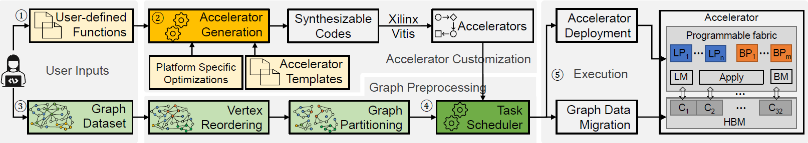

# ReGraph: Scaling Graph Processing on HBM-enabled FPGAs with Heterogeneous Pipelines

## What's new?
TBD

## Overview





The Figure above shows the overview of the ReGraph workflow. 

* **Step 1**: To obtain a custumized accelerator design for a graph application, developers only need to **write user-defined functions (UDFs)** of three stages of a GAS model with the provided programminginterface. 
* **Step 2**: ReGraph then takes the UDFs, accelerator templates and platform specific optimizations to **generate a set of synthesizable codes for accelerators** with all possible pipeline combinations. 
* **Step 3**: The synthesizable codes are compiled to bitstreams using the Xilinx Vitis toolchain. After that, users **assign the graph for acceleration**. 
* **Step 4**: ReGraph reorders vertices based on their in-degrees and partitions the graph.  Then, the task scheduler with the built-in graph-aware task scheduling method **selects the accelerator** with the most suitable numbers of Big and Little pipelines and **generates the scheduling plan**.
* **Step 5**: ReGraph deploys the selected accelerator and **runs on the target FPGA**.


## Programming Interface
With ReGraph, users can implement different graph accelerators by only writing three high-level functions: `accScatter()`, `accGather()` and `accApply()`. By default, we provide you three build-in graph algorithms, PageRank (PR), Breadth-First Search (BFS) and Closeness Centrality (CC) as examples. The desired application can be compiled by passing argument ```APP=[the algorithm]``` to ``` make ``` command.

## Accelerator generation
The number of little pipelines and big pipelines are configurable. You can change them in `./global_para.mk` by modifying `LITTLE_KERNEL_NUM` and `BIG_KERNEL_NUM`. Please note, due to the limited memory ports, for U280, the total number of pipelines, i.e., `LITTLE_KERNEL_NUM + BIG_KERNEL_NUM` should not exceed 14, for U50, the total number of pipelines should not exceed 13. 

You can also specify which SLR you want to put kernels in, and which banks you want to let each kernel access, in the file `./autogen/autogen.py`. There are three configurable variables: `apply_kernel_hbm_id`, `all_kernels_slr_id` and `all_kernels_hbm_id`. Please note, due to limited URAMs, for U50, the `LITTLE_KERNEL_DST_BUFFER_SIZE` and `BIG_KERNEL_DST_BUFFER_SIZE` should be reduced by half, i.e., 32768 and 262144, respectively.

After configurations, run `make autogen` to generate the synthesizable accelerators and the connectivity files. Below is a detailed example to config 11 little pipelines and 3 big pipelines. 

**Step 1 (MUST DO)**: modify the `./global_para.mk`: specify the number of each kind of pipelines
```makefile
#Little kernel setup 
LITTLE_KERNEL_NUM=11
LITTLE_KERNEL_DST_BUFFER_SIZE=65536
#################################################################################################################
#Big kernel setup 
BIG_KERNEL_NUM=3
BIG_KERNEL_DST_BUFFER_SIZE=524288 
#################################################################################################################
```

**Step 2 (OPTIONAL)**: modify the `./autogen/autogen.py`: config slr id and hbm id. Kindly note HBM bank 30 of U280 and HBM bank 27 of U50 are reserved for outdegree, please avoid using these two banks. For U280, we recommend you use HBM bank 0 to 29, for U50, we recommend you use HBM bank 0 to 26. To have better timing and avoid routing congestion, please assign the kernels evenly among SLRs.
```python
# configurable hbm wrapper bank id (for vertex properties)
#                         little pipeline vetex properties     |   big pipeline vetex properties
wrapper_kernel_hbm_id  = [1,3,5,7,9,11,13,15,17,19,21,             23,25,27]

# configurable little and big wrapper bank id (for edges)
#                                little pipeline vetex edges   |   big pipeline vetex properties
little_and_big_kernels_hbm_id = [0,2,4,6,8,10,12,14,16,18,20,      22,24,26]

# configurable little and big kernels slr id
#                                each little pipeline's SLR    |   each big pipeline's SLR
little_and_big_kernels_slr_id = [0,1,2,0,1,2,0,1,2,0,1,            2,1,2]
```


## Devices
The desired device can be specified by passing argument  ```DEVICES=[the device]``` to ``` make ``` command. If not specified, the default platform is U280. The below table is for quick reference.

| Argument    |  Devices  |
|--------------|--------------|
| ```DEVICES=xilinx_u280_xdma_201920_3``` | Alveo U280|
| ```DEVICES=xilinx_u50_gen3x16_xdma_201920_3``` | Alveo U50 |

## Datasets
The table below shows the details of used graph datasets, including synthetic graphs and real-world large-scale graphs.
Because the dataset is too large, we only provide the dataset generator. Run the ./dataset/rmat.m file to generate the rmat-19-32.txt.


|       Graphs     |  # of vertex | # of edge  | Average degree |     Type    |  Categories |
|:----------------:|:------------:|:----------:|:--------------:|:-----------:|:-----------:|
| rmat-19-32 (R19) |    524.3K    |    16.8M   |       32       |   Directed  |  Synthetic  | 
| rmat-21-32 (R21) |     2.1M     |    67.1M   |       32       |   Directed  |  Synthetic  |
| rmat-24-16 (R24) |    16.8M     |   268.4M   |       16       |   Directed  |  Synthetic  |
| graph500-scale23 (G23) |  4.6M  |   258.5M   |       56       |   Directed  |  Synthetic  |
| web-google (GG)  |   916.4K     |     5.1M   |        6       |   Directed  |     Web     |
| amazon-2008 (AM) |   735.3K     |     5.2M   |        7       |   Directed  |   Social    |
| web-hudong (HD)  |     2.0M     |    14.9M   |        7       |   Directed  |     Web     |
| web-baidu-baike (BB) | 2.1M     |    17.8M   |        8       |   Directed  |     Web     |
| wiki-topcats (TC) |    1.8M     |    28.5M   |       16       |   Directed  |     Web     |  
| pokec-relationships (PK) | 1.6M |    30.6M   |       19       |   Directed  |   Social    | 
| soc-flickr-und (FU) |  1.7M     |    31.2M   |        9       |  Undirected |   Social    |
| wikipedia-20070206 (WP) | 3.6M  |    45.0M   |       13       |   Directed  |     Web     |
| liveJournal (LJ) |     4.8M     |    68.9M   |       14       |  Undirected |   Social    |
| ca-hollywood-2009 (HW) |  1.1M  |   112.6M   |       53       |  Undirected |  Collabo.   |
| dbpedia-link (DB) |   18.3M     |   172.2M   |        9       |   Directed  |   Social    | 
| orkut (OR)        |    3.1M     |   234.4M   |       38       |  Undirected |   Social    |

## Run the code

#### Prerequisites
* The gcc-9.4
* Tools:
    * Vitis 2020.2
* Evaluated platforms from Xilinx:
    * Alveo U50  Data Center Accelerator Card
    * Alveo U280 Data Center Accelerator Card


#### Here is the example of implementing the accelerator for PageRank on Alveo U280 platform with Vitis 2020.2. 
```sh
$ git clone https://path/to/github/repo.git
$ cd ./ReGraph
# config num of little pipelimes (LITTLE_KERNEL_NUM) and num of little pipelimes (BIG_KERNEL_NUM)
$ vim global_para.mk
# assign slrs and hbm banks for each kernel 
$ vim ./autogen/autogen.py
# config target (TARGET), device (DEVICES), and algorithm (APP)
$ vim Makefile
# generate accelerator and connectivity files according to the specified configurations
$ make autogen
# make the host execution program and the FPGA bitstream. It takes time :)
$ make APP=pr all 
# For execution on real hardware. The path of graph dataset needs to be provided by the user. 
$ ./host_graph_fpga_pr xclbin_pr/*.xclbin ./dataset/rmat-19-32.txt 3
